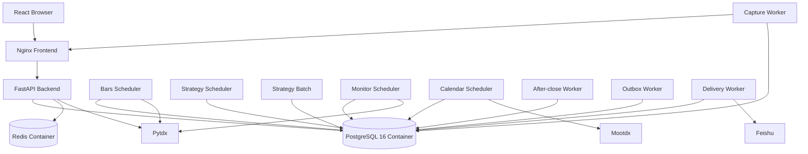

> 文档状态：CURRENT DESIGN BASELINE  
> 基线日期：2026-07-02  
> 已核对代码基线：`6f5ae2cec6b24dbd1b7bf6f23477f5e6f5096822`（`refactor/access-v2-platform-recovery`）  
> 事实来源：代码库 + 项目负责人截至 2026-07-02 已确认的产品与架构要求  
> 维护要求：任何代码、配置、测试、部署或文档修改都必须同步更新相关当前设计文档，并新增 CHANGE 记录。  
> 注意：该代码基线用于设计核对，不代表已经满足合并 `main` 或生产发布条件。
> 对齐口径：`CURRENT` 表示已确认设计，不等同于代码已完成；代码未实现、未验证或生产表现不一致的内容，必须在 `18-code-doc-alignment.md` 标为 `KNOWN_GAP`。

# 05 系统架构

## 1. 总体架构



PostgreSQL 和 Redis 都在 Compose 网络内运行。PostgreSQL 不对公网暴露 5432，数据持久化到命名 volume。

## 2. 部署单元

事实源为 `docker-compose.prod.yml`：

- postgres、redis、backend、frontend；
- worker-bars-scheduler、worker-strategy-scheduler、worker-calendar；
- worker-monitor、worker-strategy-batch、worker-outbox、worker-delivery；
- worker-after-close、worker-capture。

`CORE_ONLY` 只用于受控恢复，不能被误解为完整业务部署；飞书图片依赖 capture、outbox、delivery。

## 3. 后端依赖方向

```text
API / Worker Orchestrator
        ↓
Application / Domain Service
        ↓
Repository / Strategy Runtime / External Adapter
        ↓
PostgreSQL / Redis / External Service
```

- API：认证、权限、请求响应，不复制业务规则；
- Service：业务状态、事务、资格、幂等和编排；
- Repository：数据库访问，不判断订阅和产品语义；
- Strategy Runtime：行情输入和指标计算，不决定用户权限；
- Adapter：Pytdx、Mootdx、飞书、Redis 和截图浏览器。

## 4. 唯一正式路径

| 能力 | 正式路径 |
|---|---|
| 套餐 | Alembic 初始化 `plans` → `plan_service.py` 查询 |
| 访问资格 | `access_control_service.py` |
| Worker 用户资格 | `eligible_user_service.py` |
| DSA 批量计算 | StrategyRun → Strategy Batch → DSA Runtime → Result → 严格发布门禁 |
| 行情展示 | 统一行情聚合服务 → Bars/Indicator/Stock Detail/Capture |
| 盘中监控 | eligible watchlist → Monitor Scheduler → watchlist_monitor |
| 业务通知 | Event/Manual Share → Outbox → Delivery → Feishu |
| 截图 | CaptureJob → Capture Worker → 图片消息与 Delivery |
| 交易日历 | Calendar Service → Mootdx Provider → trading_calendar |

## 5. 数据一致性

- PostgreSQL 是正式业务状态来源；
- Redis 只保存可重建缓存、锁和短期协调状态；
- released StrategyVersion 和 published StrategyRun 不可变；
- 事件、消息、Outbox 和投递可追溯到用户、股票、源 Bar、策略版本和 Git SHA；
- Worker 使用 run key、唯一约束、心跳和租约；
- partial 实时 Bar 不写入完成 Bar 表。

## 6. 时间与时区

A 股业务时区统一为 `Asia/Shanghai`。数据库和 API 时间必须带时区或明确语义；交易时段和交易日由交易日历判断，不用简单 weekday 代替。

## 7. 实验隔离

实验使用独立分支、策略版本、结果标识和运行键，可以共享只读基础行情，但不得覆盖正式发布结果、修改生产用户数据或与生产 Worker 争抢任务。
