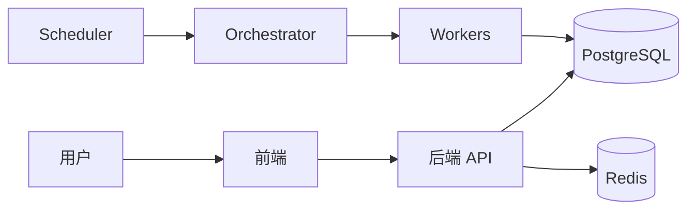

# 系统全貌 Map

核验状态：高风险偏差索引已基于 Phase 5A 核验更新（P0 Redis 隔离、P1 AC-04 已关闭）；其余组件待重建
最后核验日期：2026-07-27
核验分支：dev
核验提交：72dcd6c074212c0935090ce86acc7e48ba619dcb（Phase 4）；Phase 5A 修复见 `docs/changes/2026/CHANGE-20260727-002-after-close-daily-readiness.md`
核验范围：高风险偏差索引（§6）基于 Phase 5A 核验；其余组件关系待基于最新 dev 完整核验
对应 PRD：`../prd/00-product-scope.md`
事实所有权：系统组件、主要用户路径、盘中与盘后主流程、领域 Map 导航

> 本文件必须基于真实代码、数据、日志或运行结果填写。不得根据 PRD 推测实现已经存在。

## 1. 当前实现摘要

待基于最新 `dev` 和远程稳定版本核验。

已知运行位置只有：

- 本地开发；
- 远程稳定运行。

IDE 不构成独立环境。

## 2. PRD 实现映射

| PRD 条款 | 当前实现入口 | 状态 | 验证证据 |
|---|---|---|---|
| PS-01 | 待核验 | 未核验 | 待填写 |
| PS-02 | 待核验 | 未核验 | 待填写 |
| PS-03 | 门户和用户文案待核验 | 未核验 | 待填写 |
| PS-05 | 各领域 Map | 部分实现 | 需逐项核验 |
| PS-06 | 行情、个股和盘后输出待核验 | 未核验 | 待填写 |
| PS-07 | 仓库功能范围待核验 | 未核验 | 待填写 |

## 3. 当前组件

| 组件 | 代码或服务入口 | 责任 | 核验状态 |
|---|---|---|---|
| 前端 | 待核验 | 用户界面 | 未核验 |
| 后端 API | 待核验 | API 和业务编排 | 未核验 |
| PostgreSQL | 参见 `technical/data-storage.md` | 长期数据和正式状态 | 部分已知 |
| Redis | 参见 `technical/data-storage.md` | 队列、锁、缓存和临时状态 | 部分已知 |
| Scheduler | 参见 `30-after-close.md` | 自动触发 | 未核验 |
| Orchestrator | 参见 `30-after-close.md` | 盘后编排 | 未核验 |
| Workers | 参见 `30-after-close.md` | 子任务执行 | 未核验 |
| Nginx | 参见 `80-system-runtime.md` | 远程入口 | 部分已知 |

## 4. 主要用户路径

| 路径 | 起点 | 终点 | 对应 Map |
|---|---|---|---|
| 行情浏览 | `/market` | 个股详情 | `40-market-stock-experience.md` |
| 自选管理 | 待核验 | 自选和监控 | `50-watchlist-intraday.md` |
| 权限激活 | 待核验 | 用户能力 | `60-permissions-admin.md` |
| 管理调试 | 待核验 | 管理页面 | `60-permissions-admin.md` |
| 盘后正式结果 | 数据准备 | 发布结果 | `30-after-close.md` |

## 5. 系统流

该图是结构占位。真实服务名、方向和中间层必须核验后更新。

## 6. 与 PRD 的已知偏差（高风险索引）

| 领域 | 偏差 | 等级 | 详情位置 |
|---|---|---|---|
| 量化模型 | QM-50/QM-51 板块与指数层聚合尚未实现 | P2 | `maps/20-quant-model.md` §7 |
| ~~盘后任务~~ | ~~AC-04 与实现冲突：`checking_coverage` 仍强制检查 15m 覆盖率~~ **[Phase 5A 已关闭]** P1 | - | `maps/30-after-close.md` §7 |
| ~~盘后任务~~ | ~~本地调试若误连远程 Redis DB 0 可能消费正式队列/发布正式结果~~ **[Phase 5A 已关闭]** P0 | - | `maps/30-after-close.md` §7 |
| 量化模型 | SMC 核心未显式保留成交量信息，依赖结构面板成交参与组 | P1 | `maps/20-quant-model.md` §9 |
| 运行体系 | 本地 `docker-compose.yml` 仍保留 redis 服务，可能误导新开发者 | P3 | `maps/80-system-runtime.md` §10 |
| 运行体系 | 自动部署代码已准备但链路未启用 | P2 | `maps/80-system-runtime.md` §10 |

> 以上索引不复制详细内容。具体证据、代码路径和状态以对应 Map 为准。
>
> **[Phase 5A]** P0 Redis 隔离风险和 P1 AC-04 日线 readiness 冲突已关闭并核验。剩余高风险：P1 SMC 成交量信息（待 Phase 5B+ 处理）、P2 QM-50/QM-51 板块/指数聚合、P2 自动部署链路启用。

## 7. 已废弃路径

待核验。仅记录当前仍可能误导开发的旧入口。

## 8. 更新触发条件

- 新增或删除主要系统组件；
- 主用户路径变化；
- 盘中或盘后主流程变化；
- 领域 Map 归属变化。
