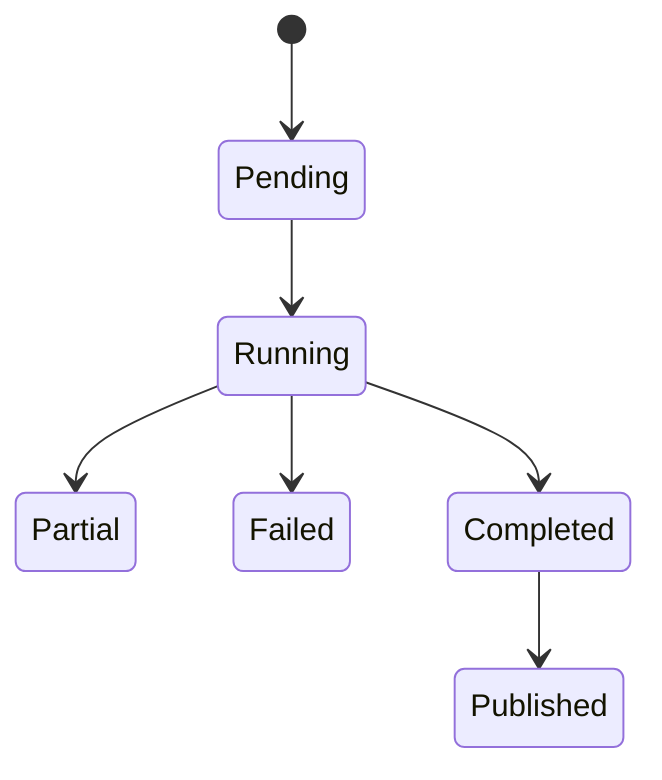

# 盘后任务 Map

核验状态：待重建  
最后核验日期：待填写  
核验分支：待填写  
核验提交：待填写  
核验范围：尚未基于最新代码完整核验  
对应 PRD：`../prd/30-after-close.md`  
事实所有权：Scheduler、readiness、Orchestrator、Worker、run、校验和发布链路

> 本文件必须基于真实代码、数据、日志或运行结果填写。不得根据 PRD 推测实现已经存在。

## 1. 当前实现摘要

盘后链路是本 Map 的唯一事实所有者。具体服务、类、函数和状态必须从最新代码与运行证据核验。

## 2. PRD 实现映射

| PRD 条款 | 当前实现入口 | 状态 | 验证证据 |
|---|---|---|---|
| AC-01 | 远程 Scheduler 待核验 | 未核验 | 待填写 |
| AC-02 | 本地 Scheduler 配置待核验 | 未核验 | 待填写 |
| AC-03 | 手动入口待核验 | 未核验 | 待填写 |
| AC-04 | 日线任务阶段待核验 | 部分实现 | 待填写 |
| AC-05 | 固定参数与 UI 只筛选待核验 | 部分实现 | 待填写 |
| AC-06 | readiness gate 待核验 | 部分实现 | 待填写 |
| AC-07 | run 创建和隔离待核验 | 部分实现 | 待填写 |
| AC-08 至 AC-10 | 发布链路待核验 | 部分实现 | 两阶段语义需核验 |
| AC-11 | 幂等补跑待核验 | 部分实现 | 待填写 |
| AC-12 | 跨 Worker re-claim 待核验 | 已知缺口 | 待填写 |
| AC-13 至 AC-14 | 状态和部分失败待核验 | 未核验 | 待填写 |
| AC-15 | 旧触发入口待核验 | 已知需清理 | 待填写 |

## 3. 主要入口

| 类型 | 路径 | 符号 | 职责 |
|---|---|---|---|
| 自动触发 | 待核验 | 待核验 | 远程 Scheduler |
| 手动运行 | 待核验 | 待核验 | 本地/远程补跑 |
| readiness | 待核验 | 待核验 | 前置检查 |
| Orchestrator | 待核验 | 待核验 | 阶段编排 |
| Worker | 待核验 | 待核验 | 子任务执行 |
| 发布 | 待核验 | 待核验 | 正式指针切换 |

## 4. 调用链

```text
Scheduler / 手动入口
→ readiness
→ 创建 run
→ Orchestrator
→ 子任务生成
→ Worker claim
→ 因子和事件计算
→ 写入候选结果
→ 完整性校验
→ 切换 published_run_id
```

逐节点填写真实代码和状态。

## 5. 状态机



这是 PRD 语义占位，不代表当前代码已实现。核验后替换为真实状态机。

## 6. 数据和状态

| 对象 | 权威存储 | 创建者 | 更新者 | 消费者 |
|---|---|---|---|---|
| run | 待核验 | 待核验 | 待核验 | 待核验 |
| 子任务 | 待核验 | 待核验 | 待核验 | Worker |
| 结果 | 待核验 | Worker | 待核验 | 发布/API |
| published_run_id | 待核验 | 发布模块 | 发布模块 | API/前端 |

## 7. 已知风险

- 15m readiness 覆盖门槛是否仍残留；
- 子 DSA 跨 Worker re-claim；
- 发布是否真正两阶段且幂等；
- 旧 `_maybe_trigger_after_close_orchestrator` 或等价入口是否仍存在；
- 本地调试是否可能误触正式发布。

以上必须基于代码重新核验。

## 8. 验证入口

- 单股；
- 指定股票池；
- 全市场；
- 重复执行；
- Worker 超时和重领；
- 部分失败；
- 发布前后 API 读取；
- 远程交易日自动运行。

## 9. 更新触发条件

任何 Scheduler、任务阶段、状态、Worker、run、发布或补跑变化都必须更新本 Map。
