# 数据结构文档

> 自动生成 by tools/update_docs.py | 生成时间: 2026-07-01 06:29:37
> 事实源: ORM 模型 (app.models.bar, app.models.instrument) + 服务配置

---

## 1. 表结构总览

| 表名 | 用途 | 主键 | 外键 |
|------|------|------|------|
| bars_daily | 日线行情 ORM 模型。 | (instrument_id, trade_date) | instrument_id → instruments.id |
| bars_minute | 分钟线行情 ORM 模型。 | (instrument_id, trade_time) | instrument_id → instruments.id |
| bars_weekly | 周线行情 ORM 模型。 | (instrument_id, trade_date) | instrument_id → instruments.id |
| bars_monthly | 月线行情 ORM 模型。 | (instrument_id, trade_date) | instrument_id → instruments.id |
| bars_15min | 15分钟线行情 ORM 模型。 | (instrument_id, trade_time) | instrument_id → instruments.id |
| bars_60min | 60分钟线行情 ORM 模型。 | (instrument_id, trade_time) | instrument_id → instruments.id |
| instruments | 股票主数据。 | (id) | 无 |
| trading_calendar | 交易日历。 | (id) | 无 |

## 2. 各表详细结构

### bars_daily

日线行情 ORM 模型。

    PK: (instrument_id, trade_date)
    FK: instrument_id -> instruments.id)

**主键**: (instrument_id, trade_date)

**外键**:
- (instrument_id) → instruments.id

| 字段名 | 类型 | 可空 | 默认值 | 主键 | 外键 | 说明 |
|--------|------|------|--------|------|------|------|
| instrument_id | UUID | 否 |  | 是 | instruments.id | 标的 UUID（FK → instruments.id） |
| trade_date | DATE | 否 |  | 是 |  | 交易日期（日线/周线/月线） |
| open | NUMERIC | 是 |  |  |  | 开盘价 NUMERIC(20,4) |
| high | NUMERIC | 是 |  |  |  | 最高价 NUMERIC(20,4) |
| low | NUMERIC | 是 |  |  |  | 最低价 NUMERIC(20,4) |
| close | NUMERIC | 是 |  |  |  | 收盘价 NUMERIC(20,4) |
| volume | NUMERIC | 是 |  |  |  | 成交量 NUMERIC(20,2)，日线单位为股，周线/月线单位为手 |
| amount | NUMERIC | 是 |  |  |  | 成交额 NUMERIC(20,2) |
| adj_factor | NUMERIC | 是 | 1.0 |  |  | 前复权因子 NUMERIC(20,8)，默认 1.0 |

### bars_minute

分钟线行情 ORM 模型。

    PK: (instrument_id, trade_time)
    FK: instrument_id -> instruments.id)

**主键**: (instrument_id, trade_time)

**外键**:
- (instrument_id) → instruments.id

| 字段名 | 类型 | 可空 | 默认值 | 主键 | 外键 | 说明 |
|--------|------|------|--------|------|------|------|
| instrument_id | UUID | 否 |  | 是 | instruments.id | 标的 UUID（FK → instruments.id） |
| trade_time | DATETIME | 否 |  | 是 |  | 交易时间（分钟线/15min/60min） |
| open | NUMERIC | 是 |  |  |  | 开盘价 NUMERIC(20,4) |
| high | NUMERIC | 是 |  |  |  | 最高价 NUMERIC(20,4) |
| low | NUMERIC | 是 |  |  |  | 最低价 NUMERIC(20,4) |
| close | NUMERIC | 是 |  |  |  | 收盘价 NUMERIC(20,4) |
| volume | NUMERIC | 是 |  |  |  | 成交量 NUMERIC(20,2)，日线单位为股，周线/月线单位为手 |
| amount | NUMERIC | 是 |  |  |  | 成交额 NUMERIC(20,2) |
| adj_factor | NUMERIC | 是 | 1.0 |  |  | 前复权因子 NUMERIC(20,8)，默认 1.0 |

### bars_weekly

周线行情 ORM 模型。

    PK: (instrument_id, trade_date)
    FK: instrument_id -> instruments.id)
    trade_date 表示该周第一个交易日（前对齐，label='left', closed='right'）。

**主键**: (instrument_id, trade_date)

**外键**:
- (instrument_id) → instruments.id

| 字段名 | 类型 | 可空 | 默认值 | 主键 | 外键 | 说明 |
|--------|------|------|--------|------|------|------|
| instrument_id | UUID | 否 |  | 是 | instruments.id | 标的 UUID（FK → instruments.id） |
| trade_date | DATE | 否 |  | 是 |  | 交易日期（日线/周线/月线） |
| open | NUMERIC | 是 |  |  |  | 开盘价 NUMERIC(20,4) |
| high | NUMERIC | 是 |  |  |  | 最高价 NUMERIC(20,4) |
| low | NUMERIC | 是 |  |  |  | 最低价 NUMERIC(20,4) |
| close | NUMERIC | 是 |  |  |  | 收盘价 NUMERIC(20,4) |
| volume | NUMERIC | 是 |  |  |  | 成交量 NUMERIC(20,2)，日线单位为股，周线/月线单位为手 |
| amount | NUMERIC | 是 |  |  |  | 成交额 NUMERIC(20,2) |
| adj_factor | NUMERIC | 是 | 1.0 |  |  | 前复权因子 NUMERIC(20,8)，默认 1.0 |

### bars_monthly

月线行情 ORM 模型。

    PK: (instrument_id, trade_date)
    FK: instrument_id -> instruments.id)
    trade_date 表示该月第一个交易日（前对齐，label='left', closed='right'）。

**主键**: (instrument_id, trade_date)

**外键**:
- (instrument_id) → instruments.id

| 字段名 | 类型 | 可空 | 默认值 | 主键 | 外键 | 说明 |
|--------|------|------|--------|------|------|------|
| instrument_id | UUID | 否 |  | 是 | instruments.id | 标的 UUID（FK → instruments.id） |
| trade_date | DATE | 否 |  | 是 |  | 交易日期（日线/周线/月线） |
| open | NUMERIC | 是 |  |  |  | 开盘价 NUMERIC(20,4) |
| high | NUMERIC | 是 |  |  |  | 最高价 NUMERIC(20,4) |
| low | NUMERIC | 是 |  |  |  | 最低价 NUMERIC(20,4) |
| close | NUMERIC | 是 |  |  |  | 收盘价 NUMERIC(20,4) |
| volume | NUMERIC | 是 |  |  |  | 成交量 NUMERIC(20,2)，日线单位为股，周线/月线单位为手 |
| amount | NUMERIC | 是 |  |  |  | 成交额 NUMERIC(20,2) |
| adj_factor | NUMERIC | 是 | 1.0 |  |  | 前复权因子 NUMERIC(20,8)，默认 1.0 |

### bars_15min

15分钟线行情 ORM 模型。

    PK: (instrument_id, trade_time)
    FK: instrument_id -> instruments.id)

**主键**: (instrument_id, trade_time)

**外键**:
- (instrument_id) → instruments.id

| 字段名 | 类型 | 可空 | 默认值 | 主键 | 外键 | 说明 |
|--------|------|------|--------|------|------|------|
| instrument_id | UUID | 否 |  | 是 | instruments.id | 标的 UUID（FK → instruments.id） |
| trade_time | DATETIME | 否 |  | 是 |  | 交易时间（分钟线/15min/60min） |
| open | NUMERIC | 是 |  |  |  | 开盘价 NUMERIC(20,4) |
| high | NUMERIC | 是 |  |  |  | 最高价 NUMERIC(20,4) |
| low | NUMERIC | 是 |  |  |  | 最低价 NUMERIC(20,4) |
| close | NUMERIC | 是 |  |  |  | 收盘价 NUMERIC(20,4) |
| volume | NUMERIC | 是 |  |  |  | 成交量 NUMERIC(20,2)，日线单位为股，周线/月线单位为手 |
| amount | NUMERIC | 是 |  |  |  | 成交额 NUMERIC(20,2) |
| adj_factor | NUMERIC | 是 | 1.0 |  |  | 前复权因子 NUMERIC(20,8)，默认 1.0 |

### bars_60min

60分钟线行情 ORM 模型。

    PK: (instrument_id, trade_time)
    FK: instrument_id -> instruments.id)

**主键**: (instrument_id, trade_time)

**外键**:
- (instrument_id) → instruments.id

| 字段名 | 类型 | 可空 | 默认值 | 主键 | 外键 | 说明 |
|--------|------|------|--------|------|------|------|
| instrument_id | UUID | 否 |  | 是 | instruments.id | 标的 UUID（FK → instruments.id） |
| trade_time | DATETIME | 否 |  | 是 |  | 交易时间（分钟线/15min/60min） |
| open | NUMERIC | 是 |  |  |  | 开盘价 NUMERIC(20,4) |
| high | NUMERIC | 是 |  |  |  | 最高价 NUMERIC(20,4) |
| low | NUMERIC | 是 |  |  |  | 最低价 NUMERIC(20,4) |
| close | NUMERIC | 是 |  |  |  | 收盘价 NUMERIC(20,4) |
| volume | NUMERIC | 是 |  |  |  | 成交量 NUMERIC(20,2)，日线单位为股，周线/月线单位为手 |
| amount | NUMERIC | 是 |  |  |  | 成交额 NUMERIC(20,2) |
| adj_factor | NUMERIC | 是 | 1.0 |  |  | 前复权因子 NUMERIC(20,8)，默认 1.0 |

### instruments

股票主数据。

**主键**: (id)

**索引**:
- ix_instruments_market_status: (market, status)
- ix_instruments_pinyin_initials: (pinyin_initials)
- ix_instruments_symbol: (symbol)

| 字段名 | 类型 | 可空 | 默认值 | 主键 | 外键 | 说明 |
|--------|------|------|--------|------|------|------|
| id | CHAR(32) | 否 |  | 是 |  | UUID 主键（数据库生成 gen_random_uuid()） |
| symbol | VARCHAR(32) | 否 |  |  |  | 股票代码（唯一，如 000001） |
| name | VARCHAR(128) | 否 |  |  |  | 股票名称 |
| pinyin_initials | VARCHAR(20) | 是 |  |  |  |  |
| market | VARCHAR(8) | 否 |  |  |  | 市场（SH/SZ/BJ） |
| status | VARCHAR(16) | 否 | active |  |  | 状态（active/delisted/suspended） |
| listing_date | DATE | 是 |  |  |  | 上市日期（可空） |
| created_at | DATETIME | 否 |  |  |  | 创建时间戳 |
| updated_at | DATETIME | 否 |  |  |  | 更新时间戳 |

### trading_calendar

交易日历。

**主键**: (id)

**索引**:
- ix_trading_calendar_date: (trade_date)

| 字段名 | 类型 | 可空 | 默认值 | 主键 | 外键 | 说明 |
|--------|------|------|--------|------|------|------|
| id | CHAR(32) | 否 |  | 是 |  | UUID 主键 |
| trade_date | DATE | 否 |  |  |  | 交易日期（唯一） |
| is_trading_day | BOOLEAN | 否 |  |  |  | 是否为交易日（由 status 派生：OPEN=true, CLOSED=false, UNKNOWN=null） |
| market | VARCHAR(8) | 否 | A |  |  |  |
| source | VARCHAR(32) | 否 | MOOTDX_HOLIDAY |  |  | 数据来源（MOOTDX_HOLIDAY/MOOTDX_HISTORICAL/MANUAL_OVERRIDE） |
| status | VARCHAR(32) | 否 | UNKNOWN |  |  | 交易日语义状态（OPEN/CLOSED/UNKNOWN） |
| verified_at | DATETIME | 是 |  |  |  | Mootdx 校验时间戳 |
| note | VARCHAR(256) | 是 |  |  |  | 人工备注或覆盖说明 |
| validation_error | VARCHAR(512) | 是 |  |  |  | 校验失败时的错误信息 |
| created_at | DATETIME | 否 |  |  |  | 创建时间戳 |

## 3. 数据流图

```mermaid
graph TD
    A[pytdx 数据源] -->|get_*_bars| B[PytdxAdapter]
    B -->|raw_df| C[bar_repository._upsert_*_bars]
    C -->|validate_bars 校验| D{校验通过?}
    D -->|是| E[adj_factor 计算]
    D -->|否| F[跳过写入 + 记录错误]
    E --> G[upsert to PostgreSQL: bars_daily/15min/60min/minute]
    G -->|查询日线| H[bar_repository._query_daily_bars]
    H -->|DataFrame| I[bars_cache Redis 缓存]
    I -->|API 响应 1d/15m/1h| J[GET /api/v1/instruments/&#123;id&#125;/bars]
    H -->|convert_kline_frequency| N[周线/月线动态合成]
    N -->|API 响应 1w/1mo| J
    G -->|对账| K[reconcile_bars.reconcile_instrument]
    G -->|保留策略| L[bars_retention.apply_retention_policy]
    G -->|新鲜度| M[freshness_sla.check_freshness]
```

## 4. 保留策略

| 表名 | 时间列 | 保留期限 | 说明 |
|------|--------|----------|------|
| bars_daily | trade_date | 永久保留 | 不清理 |
| bars_15min | trade_time | 730 天 | 清理 trade_time < cutoff 的数据 |
| bars_60min | trade_time | 730 天 | 清理 trade_time < cutoff 的数据 |
| bars_minute | trade_time | 30 天 | 清理 trade_time < cutoff 的数据 |

## 5. 数据新鲜度 SLA

| 周期 | SLA 常量 | 秒数 | 说明 |
|------|----------|------|------|
| daily | DAILY_SLA_SECONDS | 1800 | 日线收盘后 30 分钟内更新 |
| 60min | BAR_60MIN_SLA_SECONDS | 3600 | 60 分钟线周期结束后 1 小时内更新 |
| 15min | BAR_15MIN_SLA_SECONDS | 900 | 15 分钟线周期结束后 15 分钟内更新 |

**所有 SLA 常量**:

- `BAR_15MIN_SLA_SECONDS` = 900
- `BAR_60MIN_SLA_SECONDS` = 3600
- `DAILY_SLA_SECONDS` = 1800
- `MONTHLY_SLA_SECONDS` = 2592000
- `WEEKLY_SLA_SECONDS` = 604800
- `_MINUTE_CHECK_SLA_SECONDS` = 90

## 6. 策略运行时字段与版本

> 事实源: backend/app/strategy_assets/manifests/*.yaml

| strategy_id | kind | version | display_name |
|-------------|------|---------|--------------|
| dsa_selector | selector | 1.4.1 | 趋势选股 |
| watchlist_monitor | monitor | 1.1.0 | 自选股监控 |

### 6.1 MonitorSnapshot 运行时字段（watchlist_monitor outputs）

> 监控策略的运行时输出字段（非数据库表字段），通过 MonitorSnapshot 透传到 API 响应。

| field | type | unit | description |
|-------|------|------|-------------|
| bb_upper | number |  | 布林带上轨 |
| bb_mid | number |  | 布林带中轨 |
| bb_lower | number |  | 布林带下轨 |
| current_price | number |  | 当前价格 |
| prev_close | number |  | 前一根1分钟收盘价 |
| bb_width | number |  | 布林带宽度 |
| bb_pos | number |  | 布林带位置（0-1） |
| previous_close | number |  | 上一交易日收盘价（前复权） |
| change_pct | number | percent | 当日涨跌幅（%） |
| upper_node | json |  |  |
| lower_node | json |  |  |
| position_0_1 | number | ratio_0_1 |  |
| poc_price | json |  |  |
| last_touched_node | json |  |  |

**注**: `previous_close` 与 `change_pct` 为 advice.md v4 新增字段，用于自选股实时涨跌幅展示。

### 6.2 profile_meta 诊断字段（Node Cluster）

> `profile_meta` 由 `prepare_node_cluster_bars` 返回，包含以下诊断字段：
> - `input_daily_bars` / `input_15m_bars` / `input_minute_bars`：准备后的实际根数
> - `primary_period` / `low_period`：主周期与低周期
> - `parameter_version`：参数版本标识
>
> 期望值与参数说明详见 [指标参数基线.md](指标参数基线.md#profile_meta-诊断字段node-cluster)

### 6.3 指标响应字段（indicator_service）

> 事实源：`backend/app/services/indicator_service.py` + `backend/app/services/chart_bars_service.py`
> `compute_all_indicators` 响应包含数据源诊断字段与 DSA 可视化契约字段。

**数据源诊断字段**（顶层响应字段）：

| 字段 | 类型 | 说明 |
|------|------|------|
| `source_bar_times` | list[str] | 250 个 ISO 日期字符串（行情输入时间序列） |
| `source_bar_hash` | str | OHLCV 拼接的 SHA256 哈希前 16 位（数据源指纹） |

**DSA 可视化契约字段**（`data.dsa_selector` 内）：

| 字段 | 类型 | 说明 |
|------|------|------|
| `time` | list[str] | 250 个 ISO 日期字符串（与 `source_bar_times` 一致） |
| `visual_segments` | list[dict] | Pine 风格线段，每段含 `direction`(1/-1) 和 `points`([{time,value}]) |
| `dsa_vwap` | list[float\|None] | 每 bar 的趋势参考价（因子序列） |
| `dsa_dir` | list[int] | 每 bar 的方向（1/-1） |
| `regime_id` | list[int] | 每 bar 所属 regime 编号 |
| `anchor_time` | list[str\|None] | 锚点时间（仅锚点 bar 非空，ISO datetime） |
| `pivot_type` | list[str\|None] | pivot 类型（HH/HL/LH/LL） |
| `pivot_price` | list[float\|None] | pivot 价格 |

> 详细渲染规则见 [策略与指标口径.md](策略与指标口径.md#27-图表渲染契约dsa_polyline--visual_segments)

